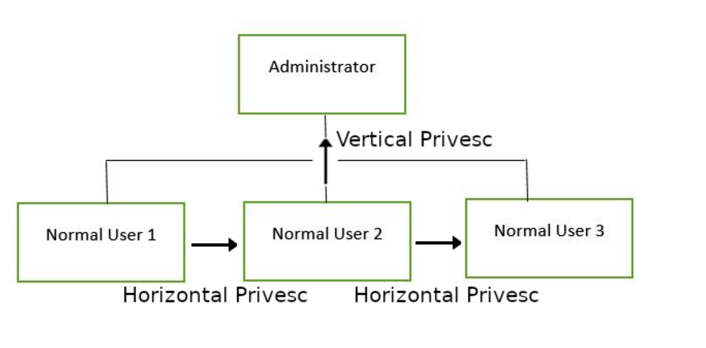
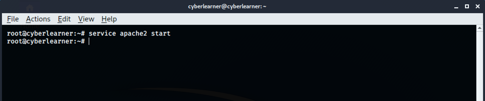
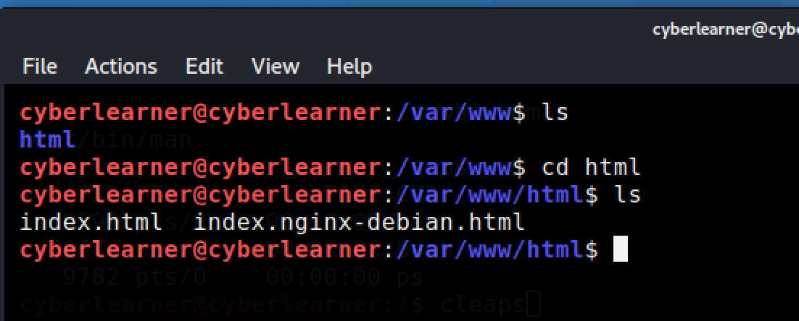
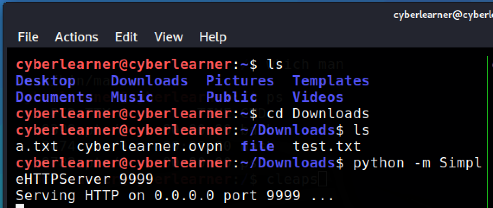
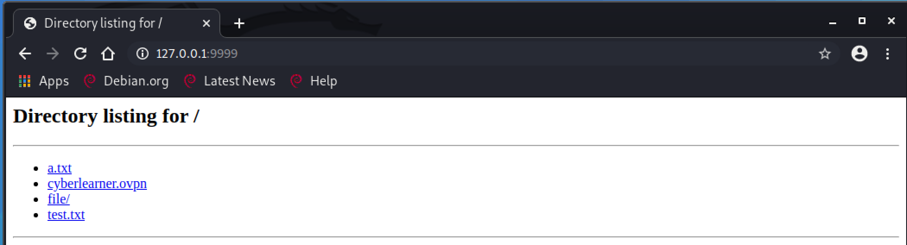
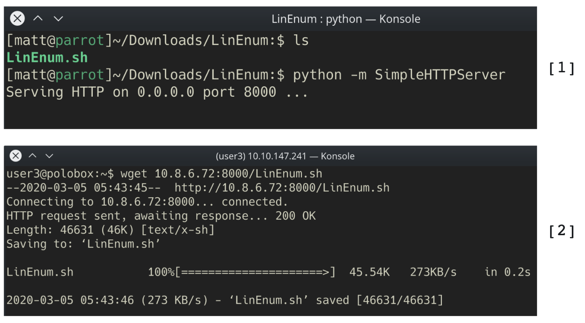
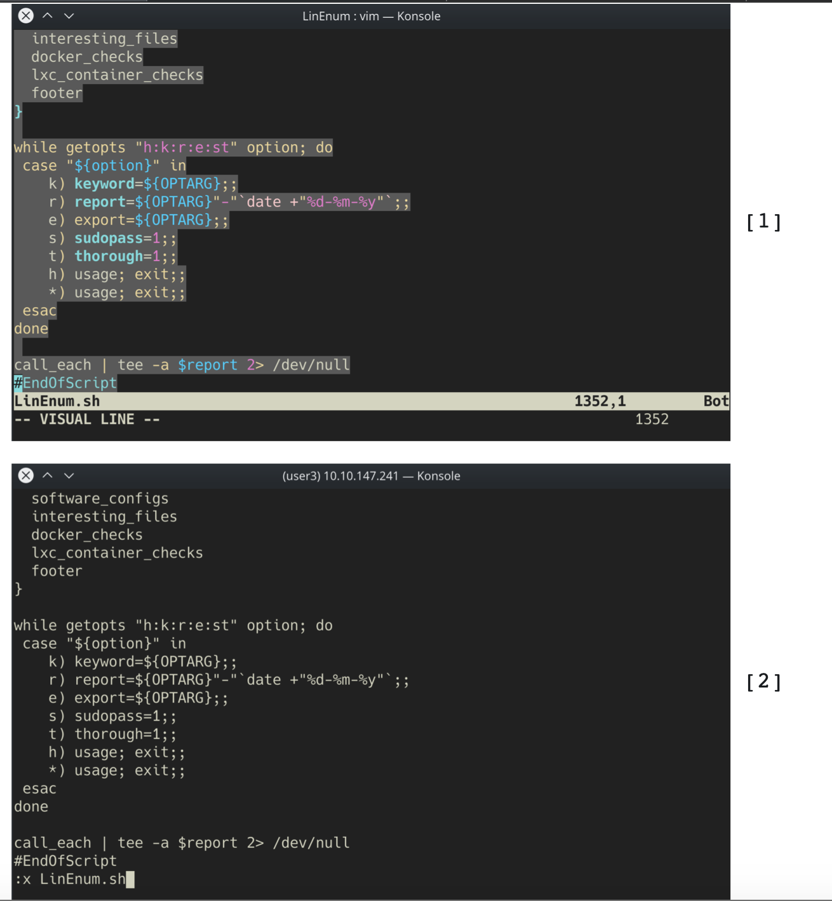

## **What is privilege esacalation?**

At it's core, Privilege Escalation usually involves going from a lower permission to a higher permission. More technically, it's the exploitation of a vulnerability, design flaw or configuration oversight in an operating system or application to gain unauthorized access to resources that are usually restricted from the users.

## **Why is it important?**

Rarely when doing a CTF or real-world penetration test, will you be able to gain a foothold (initial access) that affords you administrator access. Privilege escalation is crucial, because it lets you gain system administrator levels of access. This allow you to do many things, including:

- Reset passwords
- Bypass access controls to compromise protected data
- Edit software configurations
- Enable persistence, so you can access the machine again later.
- Change privilege of users
- Get that cheeky root flag ;)

As well as any other administrator or super user commands that you desire.

## **Privilege Tree**



There are **two main privilege escalation variants:**

- **Horizontal privilege escalation:** This is where you expand your reach over the compromised system by taking over a different user who is on the same privilege level as you. For instance, a normal user hijacking another normal user (rather than elevating to super user). This allows you to inherit whatever files and access that user has. This can be used, for example, to gain access to another normal privilege user, that happens to have an SUID file attached to their home directory (more on these later) which can then be used to get super user access. [Travel sideways on the tree]

- **Vertical privilege escalation (privilege elevation):** This is where you attempt to gain higher privileges or access, with an existing account that you have already compromised. For local privilege escalation attacks this might mean hijacking an account with administrator privileges or root privileges. [Travel up on the tree]

## **Enumeration**

**What is LinEnum?**

LinEnum is a simple bash script that performs common commands related to privilege escalation, saving time and allowing more effort to be put toward getting root. It is important to understand what commands LinEnum executes, so that you are able to manually enumerate privesc vulnerabilities in a situation where you're unable to use LinEnum or other like scripts. In this room, we will explain what LinEnum is showing, and what commands can be used to replicate it.

I have downloaded LinEnum.sh file and saved in this repo.
https://github.com/rebootuser/LinEnum/blob/master/LinEnum.sh

Before continuing, need to learn how to host the website on personal kali machine and making it as a server.

```bash
# starting the apache service.
service apache2 start

#stoping the apache service
service apache2 stop
```



This is the location of the index.html file and a place where we can host our malicious website.



Refer this link: https://phoenixnap.com/kb/ubuntu-start-stop-restart-apache

There is another way to make a server

### SimpleHTTPServer

SimpleHTTPServer is a python module which allows you to instantly create a web server or serve your files in a snap. Main advantage of python’s SimpleHTTPServer is you don’t need to install anything since you have python interpreter installed. You don’t have to worry about python interpreter because almost all Linux distributions, python interpreter come handy by default.

You also can use SimpleHTTPServer as a file sharing method. You just have to enable the module within the location of your shareable files are located.

On any directory of whom we want to serve our files, we just direct to that location and start this server.

Here we dont have restriction to just go to /var/www/html directory only.



We have called the loopback address with the custom port 9999. By default the port is 8080. If 8080 is not available because of the another service (like apache) may be hosted, we can have the custom port number.



## Now, How do I get LinEnum on the target machine?

There are two ways to get LinEnum on the target machine. The first way, is to go to the directory that you have your local copy of LinEnum stored in, and start a Python web server using "python -m SimpleHTTPServer 8000" [1].

Then using "wget" on the target machine, and your local IP, you can grab the file from your local machine [2].

Then make the file executable using the command "chmod +x FILENAME.sh".



Other Methods

In case you're unable to transport the file, you can also, if you have sufficient permissions, copy the raw LinEnum code from your local machine [1] and paste it into a new file on the target, using Vi or Nano [2]. Once you've done this, you can save the file with the ".sh" extension. Then make the file executable using the command "chmod +x FILENAME.sh". You now have now made your own executable copy of the LinEnum script on the target machine!



### Running LinEnum

LinEnum can be run the same way you run any bash script, go to the directory where LinEnum is and run the command "./LinEnum.sh".

## Understanding LinEnum Output

The LinEnum output is broken down into different sections, these are the main sections that we will focus on:

**Kernel** Kernel information is shown here. There is most likely a kernel exploit available for this machine.

Can we read/write sensitive files: The world-writable files are shown below. These are the files that any authenticated user can read and write to. By looking at the permissions of these sensitive files, we can see where there is misconfiguration that allows users who shouldn't usually be able to, to be able to write to sensitive files.

**SUID Files:** The output for SUID files is shown here. There are a few interesting items that we will definitely look into as a way to escalate privileges. SUID (Set owner User ID up on execution) is a special type of file permissions given to a file. It allows the file to run with permissions of whoever the owner is. If this is root, it runs with root permissions. It can allow us to escalate privileges.

**Crontab Contents:** The scheduled cron jobs are shown below. Cron is used to schedule commands at a specific time. These scheduled commands or tasks are known as “cron jobs”. Related to this is the crontab command which creates a crontab file containing commands and instructions for the cron daemon to execute. There is certainly enough information to warrant attempting to exploit Cronjobs here.

There's also a lot of other useful information contained in this scan. Lets have a read!
