# Useful Linux Commands

This document contains the useful linux commands that I need personally quite often when I learnt linux.

## SSH

SSH is the act of remotely accessing a machine. SSH allows you to run commands interactively on the remote machine. This is done through the use of a program on the target machine, which allows the ssh client to interface with the target host.

SSH works through a command line, meaning anything done on the target machine will be done through a command prompt similar to this.

Depending on the operating system, like Windows have PuTTY and linux has command line option of ssh.

```bash
ssh user_name@MACHINE_IP

#for example
ssh bob@10.10.203.34
```

After this it would prompt to ask for the password and, after that we can interact with the remote machine through command line.

## MAN

To check the manual of each command we can use the man command and to check the flag associated with each command, all info related to flags is stored in DESCRIPTION section.

```bash
man echo
```

Another useful command that I often use along with man command is **grep** command

```bash
man ls | grep -e "long list"
```

It would search the manual of the ls command and output those lines which contains this expression "long list". It makes it easier to search the manual and look for the flags.

## LS

ls is a command that lists information about every file/directory in the directory. Just running the ls command outputs the name of every file in the directory.

```bash
#To list every file/directory in the given directory
ls

#To list all files/directories including the hidden one in the given directory
ls -a

#To list in long list format
ls -l
```


## CAT

It outputs the contents of the files to the console.

```bash
# To output the contents of the file on the console.
cat a.txt

# To output the contents of the file along with line number
cat -n a.txt
```

Note: cat supports the **--help** flag meaning that you can **see useful flags** without going to the man page!

## TOUCH

touch is a pretty simple command, it creates files.

```bash
# To simply create the file
touch a.txt
```

## ABSOLUTE AND RELATIVE PATHS

The below shows the relative paths.

1. Current Directory .
2. Directory Before the current directory ..
3. The User's home directory ~ => ~/hello_world

In Absolute path terms

3. /home/(current user) => /home/(current_user)/hello_world

## BINARY FILE

It is a file stored in binary format. A binary file is computer readable not human readable.

What is hexdump?

The **hd** or **hexdump** command in Linux is used to filter and display the specified files, or standard input in a human readable specified format

- -b : One-byte octal display. Display the input offset in hexadecimal, followed by sixteen space-separated, three column, zero-filled, bytes of input data, in octal, per line.

  

  The first column of the output represents the input offset in file.

- -c : One-byte character display. Display the input offset in hexadecimal, followed by sixteen space-separated, three column, space-filled, characters of input data per line.

  

- -C : Canonical hex+ASCII display. Display the input offset in hexadecimal, followed by sixteen space-separated, two column, hexadecimal bytes, followed by the same sixteen bytes in %\_p format enclosed in “|” characters.

  

- -d : Two-byte decimal display. Display the input offset in hexadecimal, followed by eight space-separated, five column, zero-filled, two-byte units of input data, in unsigned decimal, per line.
  

- -n length : Where length is an integer. Interprets only ‘length’ bytes of output.

  

To get to know about another flags associated with hexdump refer to:
https://www.geeksforgeeks.org/hexdump-command-in-linux-with-examples/

```bash
# To run a binary file
./shiba1

# To see the contents of the binary file
hexdump -C shiba1
```

## SU AND SUDO

su is a command that allows you to change the user, without logging out and logging back in again.

Note : Typing **su** on its own is equivalent to typing **su root**.

**Interactive:** As the term implies: Interactive means that the commands are run with user-interaction from keyboard. E.g. the shell can prompt the user to enter input.

**Non-interactive:** the shell is probably run from an automated process so it can't assume if can request input or that someone will see the output. E.g Maybe it is best to write output to a log-file.

**Login:** Means that the shell is run as part of the login of the user to the system. Typically used to do any configuration that a user needs/wants to establish his work-environment.

**Non-login:** Any other shell run by the user after logging on, or which is run by any automated process which is not coupled to a logged in user.

How to switch the User to root.

The main difference between these commands is in the way they restrict access to their functions.

su (which means "substitute user" or "switch user") - does exactly that, it starts another shell instance with privileges of the target user. To ensure you have the rights to do that, it asks you for the password of the target user. So, to become root, you need to know root password. If there are several users on your machine who need to run commands as root, they all need to know root password - note that it'll be the same password. If you need to revoke admin permissions from one of the users, you need to change root password and tell it only to those people who need to keep access - messy.

sudo (hmm... what's the mnemonic? Super-User-DO?) is completely different. It uses a config file (`/etc/sudoers`) which lists which users have rights to specific actions (run commands as root, etc.) When invoked, it asks for the password of the user who started it - to ensure the person at the terminal is really the same "joe" who's listed in `/etc/sudoers`. To revoke admin privileges from a person, you just need to edit the config file (or remove the user from a group which is listed in that config). This results in much cleaner management of privileges.

As a result of this, in many Debian-based systems root user has no password set - i.e. it's not possible to login as root directly.

Also, `/etc/sudoers` allows to specify some additional options - i.e. user X is only able to run program Y etc.

The often-used sudo su combination works as follows: first sudo asks you for your password, and, if you're allowed to do so, invokes the next command (su) as a super-user. Because su is invoked by root, it does not require you to enter the target user's password. So, sudo su allows you to open a shell as another user (including root), if you're allowed super-user access by the `/etc/sudoers` file.

Refer this stackoverflow link:  
https://askubuntu.com/questions/70534/what-are-the-differences-between-su-sudo-s-sudo-i-sudo-su

Another useful link:

http://researchhubs.com/post/computing/linux-cmd/sudo-command.html

### SUDO

sudo is Linux's run as administrator button, and the syntax goes `sudo <command>`.


Note: whoami is just a command that states your current user.

As you can see when using sudo the command is run as root. It is important to note that **you need to have your current user's password to use it.**

NOTE:

Not every user has the permission to use sudo. Only those users who are mentioned in the config file `/etc/sudoers`

Login as root and give permission to the user for the sudo access.

```bash
# Adding user to the sudo group
usermod -aG sudo username
```

```bash
# To list your current sudo privileges(what commands you can run, who you can run them as etc.

sudo -l
```

Refer this link to add some authorization rules while giving sudo permission.

https://linuxize.com/post/how-to-add-user-to-sudoers-in-ubuntu/

## USERMOD UTILITY

In Unix/Linux distributions, the command **usermod** is used to modify or change any attributes of a already created user account via command line.

After creating user accounts, in some scenarios where we need to change the attributes of an existing user such as, change user’s home directory, login name, login shell, password expiry date, etc, where in such case ‘usermod’ command is used.

When we execute ‘usermod‘ command in terminal, the following files are used and affected.

- /etc/passwd – User account information.
- /etc/shadow – Secure account information.
- /etc/group – Group account information.
- /etc/gshadow – Secure group account information.
- /etc/login.defs – Shadow password suite configuration..

### ADD USER OR GROUP

NOTE:

Only root user has the permission to perform this below commands.

To add a new user or group,

```bash
sudo adduser username
```


```bash
sudo addgroup groupname
```


### Change User Shell

The user login shell can be changed or defined during user creation with useradd command or changed with ‘usermod‘ command **using option ‘-s‘** (shell). For example, the user ‘babin‘ has the **/bin/bash** shell by default, now I want to change it to **/bin/sh**.

```bash
grep -E --color 'babin' /etc/passwd
usermod -s /bin/sh babin
```

After changing user shell, verify the user shell using the following command.

```bash
grep -E --color 'babin' /etc/passwd
```


### Adding the Group to an Existing User

```bash
usermod -a -G tecmint_test0 tecmint

id tecmint
```


**Note:** Be careful, while adding a new groups to an existing user with ‘-G’ option alone, will remove all existing groups that user belongs. So, always add the ‘-a‘ (append) with ‘-G‘ option to add or append new groups.

If we want to modify any detail of the already created user.

The complete guide to learn about **usermod** command is mentioned in th link below:
https://www.tecmint.com/usermod-command-examples/

## What is Shell?

The shell is the command interpretor in an operating system such as Unix or GNU/Linux, it is a program that executes other programs. It provides a computer user an interface to the Unix/GNU Linux system so that the user can run different commands or utilities/tools with some input data.

To check which shell is running on my system

```bash
# By default on Kali, it is bash shell.
# By default on Mac, it is zsh shell.

echo $SHELL

```

To learn about different types of shells:

https://www.tecmint.com/different-types-of-linux-shells/

## Linux Operators

### **">" operator**

">" is the operator for output redirection. Meaning that you can redirect the output of any command to a file.
For example if I were to run echo hello > file, then instead of outputting hello to the console, it would save that output to a file called file.

```bash
echo "This is the text" > fileName
```

It is worth noting that if you were to use this operator on a file that already exists, it would completely erase the contents of that file and replace it with the output from your command


### **">>" operator**

">>" does mainly the same thing as >, with one key difference. >> appends the output of a command to a file, instead of erasing it.

```bash
echo "This is the text" >> fileName
```


### **"&&" operator**

&& allows you to execute a second command after the first one has executed successfully.

Meaning `ls && echo hello` will work fine, but `dljahfrsdkjlhfsdhjklfsdhkljfh && echo hello` will fail.


This is the command that we oftenly use in our day to day commands.

```bash
echo hello >> file && cat file
```

We created something in the first command and used it in the second command.

### **"&" command**

& is a shell backgrounding operator.

Much unlike &&, & has nothing to do with and at all. & is a background operator, meaning say you run a command that takes 10 seconds to run, normally you wouldn't be able to run commands during that period; however, with & that command will still execute and you'll be able to run other commands.


## **"\$" operator**

It is used to denote environment variables.These are variables set by the computer(you can set them yourself but we'll get into that) that are used to affect different processes and how they work. Meaning that if you edit these variables you can change how certain processes work on your computer.

If we want to read any environment variables, we can read it using \$ operator.

```bash
#Outputs the current user who has logged in.

echo $USER

## To display the shell that we are currently using.

echo $SHELL

## Display the value of home environment variable

echo $HOME
```

## **Understanding Environment variables**

### Set the environment variable.

```bash
export nootnoot = 1111

echo $nootnoot

#Shows the value set 1111
```


### Unset the environment variable

```bash
unset VARIABLE_NAME
```

### List all the environment variables.

```bash
set
```

## PIPE "|" Operator

The | operator allows you to take the output of a command and use it as input for a second command.


## ";" Operator

The ; operator works a lot like &&, however it does not require the first command to execute successfully.


## CHMOD

chmod allows you to set the different permissions for a file, and control who can read it.

They're set using a three digit number, where each digit controls a specific permission, meaning

First digit - controls the permissions for a user

Second digit - controls the permission for a group

Third digit - controls permissions for everyone that's not a part of the user or group.

| Digit | Meaning                                         |
| ----- | ----------------------------------------------- |
| 1     | That file can be executed                       |
| 2     | That file can be written to                     |
| 3     | That file can be executed and written to        |
| 4     | That file can be read                           |
| 5     | That file can be read and executed              |
| 6     | That file can be written to and read            |
| 7     | That file can be read, written to, and executed |

The way these values are calculated is this. The digit 1 means the file can be executed, the digit 2 means it can be written to, and the digit 4 means it can be read. You get the different permissions by adding these digits together. For example 1+2 is 3 meaning that file can be executed and written to. Now let's see how it all works in perspective.

Now, understanding the permissions of the different files.

- chmod 341 file : The file can be executed and written to by the user that owns the file. The file can be read by the group that owns the file. The file can be executed by everyone else.

- chmod 777 file : The file can be read, written to, and executed by the user that owns the file. The file can be read, written to, and executed by the group that owns the file. The file can be read, written to, and executed by everyone else

**ls** provides a helpful way of viewing the permissions of files in the current directory.


Recall that file permissions are divided into three sections, user and group and everyone else. The same is true here; however, everything starts from the second hyphen not the first, so we can just forget the first hyphen for now.

The first three characters control permissions for the user, the second three characters control permissions for the group, and the final three characters control permissions for everyone else


(U = user, G = group, E = everyone else)

rw means as you might expect "read and write", meaning the user has read write perms to the file. Following that logic, that means members of the group and everyone else have only read perms. To convert that to numbers the permissions for that file in number form are 644. We can test this by trying to change the permissions


Note: It is possible to give someone no perms to a file, You can just put 0 as the digit. 770 Means that everyone that isnt a part of the user or group cant do anything to the file.

## CHOWN COMMAND

Recall that ls allows shows us our username twice in one of it's fields.


These attributes are the user, and group attributes resepectively.

Chown command, which allows us to change the user and group for any file.

Note: You can only use chown if you are "above" that other user, meaning that chown is best done with the root(administrator) user.

```bash
chown owner : group file
```


You can also use chown without specifying a group. So you can just use chown user file if you only wanted to change the user but keep the group.

```bash
chown owner : file
```

If we want change the owner or group name permission in each of the file in the root directory at once.

```bash
chown -R owner : group file
```

## rm Command

rm can make the linux system completely useless if we use it carelessly.

```bash
rm file
```

It is not worth noting that you need write permissions to the file to deleted so you cant just delete any file if you're a regular user.


To remove every file in the directory, we need to use **-r** flag.

```bash
rm -r directory

# To supress the warning prompts

rm -f file
```

## mv Command

mv allows you to move files from one place to another. The syntax for the command is:

```bash
# To move the file to the user's home directory (relative path)

mv file ~
```

Note: You can also use mv to change the name of file.

```bash
mv file ~/renamedFile
```

## cp Command

cp does mainly the same thing as mv, except instead of moving the file it duplicates(copies) it.

```bash
cp file ~/renamedFile
```

## cd and mkdir

Linux allows you to change the location of the current directory through the use of the cd command.


For eg, to move to the user's home directory,

```bash
cd ~
```

## ln

ln is a weird one, because it has two different main uses. One of those is what's known as **"hard linking"**, which completely duplicates the file, and links the duplicate to the original copy. Meaning What ever is done to the created link, is also done to the original file.

```bash
ln source destination
```


It's important to be very careful with hard links, as depending on what you're doing it can be very easy to erase data from a file.

The next form of linking is **symbolic linking(symlink)**.

While a hard linked file contains the data in the original file, a symbolic link is just a glorified reference. Meaning that the actual symbolic link has no data in it at all, it's just a reference to another file.

The syntax for a symbolic link is the exact same, but it uses the -s flag, so to create a symbolic link, you would run

```bash
ln -s file destination
```


NOTE:

ls even shows that its a symbolic link with the arrow pointing to what the link is referencing. It is important to note the permissions on the symlink. It has full 777 perms meaning that in theory you can execute the symlink, however since it is just a reference, in reality it has the same perms as the original file.


## FIND COMMAND

**find** is an incredibly powerful, but incredibly simple command. It allows you to do just as it says, find files. It does this by listing every file in the current directory,

It is worth noting that find is recursive, so it searches every directory that is in the original directory you provided.

```bash
# To find every file in the user's home directory
find ~/

# To list every file in the OS.
find /
```

NOTE:

Only those files or directories would be listed for whom that particular user has the permission, means you cant list every file for every user.

```bash
# To list every file owned by particular user.
find dir -user username


# To list every file owned by particular group.
find dir -group groupname


#To find all *.c file belongs to a group called “ftpusers” in /data/project directory, run:

find /data/project -group ftpusers -name "*.c"

# To do case insensitive search

find /data/project -group ftpusers -iname "*.c"

#Find files by two users vivek and wendy

### match files only ##

find / -type f -user vivek -o -user wendy

### match dirs only ##

find / -type d -user vivek -o -user wendy
```

### Find the files with particular permissions.

```bash
find -perm mode
```

We can specify the MODE in three different ways as listed below.

- If we specify the mode without any prefixes, it will find files of **exact** permissions.

- If we use “-“ prefix with mode, **at least** the files should have the given permission, not the exact permission.

- If we use “/” prefix, either the owner, the group, or other should have permission to the file.

Refer this link for more info. https://www.ostechnix.com/find-files-based-permissions/

## GREP

The most useful command in linux command line.

It allows you find data inside of data. When working with large files, or a large output, it is arguably the best way to narrow the output down to better find what your looking for.

To find the file **test1234** in the whole OS whose location is unknown.

```bash
find /* | grep test1234
```


We can use the grep to find the content string in the file, and we can list the line number using **-n** flag.

```bash
grep "string" testFile -n
```


NOTE:

We can use the **regular expressions** instead of strings.

### NANO

nano is a terminal based text editor. The syntax for nano is `nano <file you want to write to>`

### IMPORTANT FILES AND DIRECTORIES

- **/etc/passwd** - Stores user information - Often used to see all the users on a system

Understanding this file:

The /etc/passwd contains one entry per line for each user (user account) of the system. All fields are separated by a colon (:) symbol. Total of seven fields as follows. Generally, /etc/passwd file entry looks as follows:


**/etc/passwd Format**

From the above image:

1. Username: It is used when user logs in. It should be between 1 and 32 characters in length.

2. Password: An x character indicates that encrypted password is stored in /etc/shadow file. Please note that you need to use the passwd command to computes the hash of a password typed at the CLI or to store/update the hash of the password in /etc/shadow file.
3. User ID (UID): Each user must be assigned a user ID (UID). UID 0 (zero) is reserved for root and UIDs 1-99 are reserved for other predefined accounts. Further UID 100-999 are reserved by system for administrative and system accounts/groups.
4. Group ID (GID): The primary group ID (stored in /etc/group file)
5. User ID Info: The comment field. It allow you to add extra information about the users such as user’s full name, phone number etc. This field use by finger command.
6. Home directory: The absolute path to the directory the user will be in when they log in. If this directory does not exists then users directory becomes /
7. Command/shell: The absolute path of a command or shell (/bin/bash). Typically, this is a shell. Please note that it does not have to be a shell.

To list all the users, simply use the cat command

```bash
cat /etc/passwd
```

To search for a username called tom, use the grep command:

```bash
grep tom /etc/passwd

#OR

cat /etc/passwd | grep -e "root"
```

**Reading /etc/passwd file**

```bash
#!/bin/bash
# seven fields from /etc/passwd stored in $f1,f2...,$f7
#
while IFS=: read -r f1 f2 f3 f4 f5 f6 f7
do
 echo "User $f1 use $f7 shell and stores files in $f6 directory."
done < /etc/passwd
```


Also refer this link for more clarity of passwd file as well as shadow file. https://www.digitalocean.com/community/tutorials/how-to-use-passwd-and-adduser-to-manage-passwords-on-a-linux-vps

- **/etc/shadow file**

The **/etc/shadow** file stores actual password in encrypted format (more like the hash of the password) for user’s account with additional properties related to user password.


1. **Username** : It is your login name.
2. **Password** : It is your encrypted password. The password should be minimum 8-12 characters long including special characters, digits, lower case alphabetic and more. Usually password format is set to $id$salt$hashed, The $id is the algorithm used On GNU/Linux as follows:
   - $1$ is MD5
   - $2a$ is Blowfish
   - $2y$ is Blowfish
   - $5$ is SHA-256
   - $6$ is SHA-512
3. **Last password change (lastchanged)**: Days since Jan 1, 1970 that password was last changed
4. **Minimum** : The minimum number of days required between password changes i.e. the number of days left before the user is allowed to change his/her password
5. **Maximum** : The maximum number of days the password is valid (after that user is forced to change his/her password)
6. **Warn** : The number of days before password is to expire that user is warned that his/her password must be changed
7. **Inactive** : The number of days after password expires that account is disabled
   Expire : days since Jan 1, 1970 that account is disabled i.e. an absolute date specifying when the login may no longer be used.

The encrypted password consists of 13 to 24 characters from the 64 character alphabet a through z, A through Z, 0 through 9, \. and /. Optionally it can start with a “$” character. This means the encrypted password was generated using another (not DES) algorithm. For example if it starts with “$1\$” it means the MD5-based algorithm was used. Please note that a password field which starts with a exclamation mark (!) means that the password is locked. The remaining characters on the line represent the password field before the password was locked.

Read this link for more info : https://www.cyberciti.biz/faq/understanding-etcshadow-file/

## **/etc/hosts** file

All operating systems with network support have a hosts file in order to translate hostnames to IP addresses. Whenever you open a website by typing its hostname, your system will read through the hosts file to check for the corresponding IP and then open it. The hosts file is a simple text file located in the etc folder on Linux and Mac OS (/etc/hosts). Windows has a hosts file as well, on Windows you can find it in Windows\System32\drivers\etc\

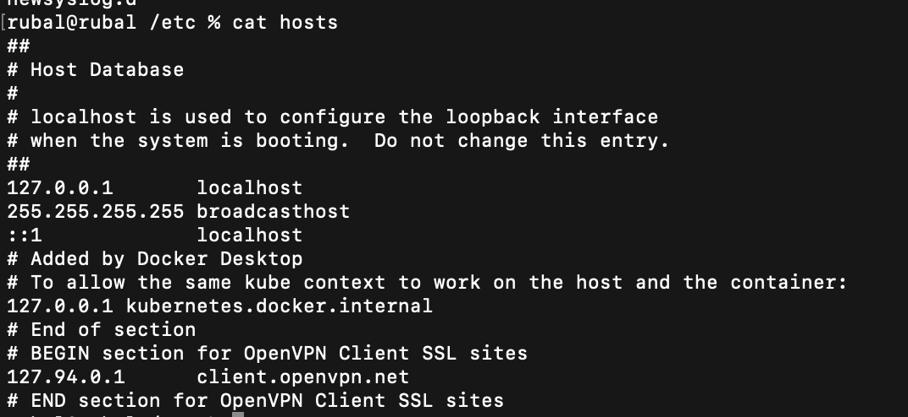

From what we mentioned, you might be expecting this file to have a very long list of IPs and corresponding hostnames; but that is not true. The hosts file only contains a number of lines;

The first part, by default, contains hostnames and IP addresses of your localhost and machine. This is the part you will usually modify in order to make the desired changes.
The second part has information about IPv6 capable hosts and you will hardly be editing these lines.
Whenever you type an address, your system will check the hosts file for its presence; if it is present there, you will be directed to the corresponding IP. If the hostname is not defined in the hosts file, your system will check the DNS server of your internet to look up for the corresponding IP and redirect you accordingly.

What hosts file act is the local dns of the system, when we hit any domain, the system would first check the hosts file and if it doesn't find, then it goes to the DNS server of the internet to check.

Refer these links for more info:

https://vitux.com/linux-hosts-file/

https://unix.stackexchange.com/questions/421491/what-is-the-purpose-of-etc-hosts

## Installing a package

To install packages you need root permissions, as each package will likely modify some system critical directories such as /usr.

The syntax to install packages is `apt install package`

## Processes

A process is just another word for a running program. A list of user created processes can be viewed with the `ps` command.


To view a list of all system processes, you have to use the -ef flag `ps -ef`


Every process that is currently running on the system is listed, along with some basic information about the process. Arguably the most interesting part about that list is the second column, the 3-5 digit numbers. Those are known as Process ID's(PID's) and they're how you interact with the processes. 90% of the time you'll likely be wanting to stop these processes and that's done with the kill command(an apt choice of naming I know).

The syntax of kill is `kill <PID>`.

Another useful way to interact with PID's is through the command `top`. `top` shows you what processes are taking up the most system resources, which allows you to manage the resource allocation on your system by killing unneeded processes.

## How to unzip a file using Terminal

```bash
sudo apt-get install unzip

unzip file.zip -d destination_folder

#If source and destination are same
unzip file.zip

#To unzip a tar.gz file
tar -xvf file.tar.gz
```

## What are Cronjobs and where are they saved?

Refer this link for more info.

https://www.cyberciti.biz/faq/how-do-i-add-jobs-to-cron-under-linux-or-unix-oses/


## Where are command Aliases stored

Refer this link for more info.
http://lewiscomputerhowto.blogspot.com/2014/01/how-to-make-permanent-alias-in-kali.html

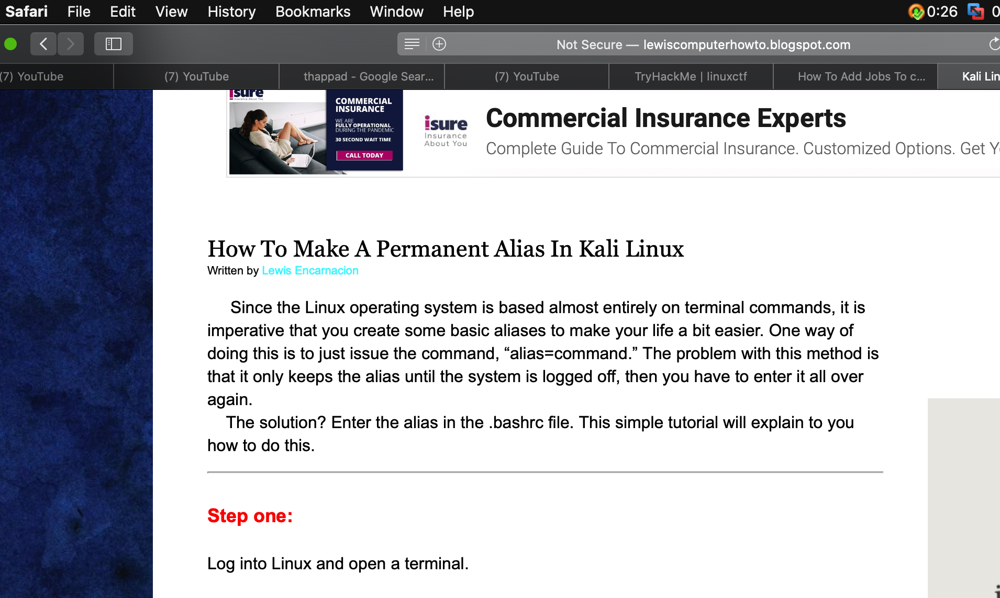

Open the .bashrc file and go down till we find where aliases stored.

### This is how we write command aliases.

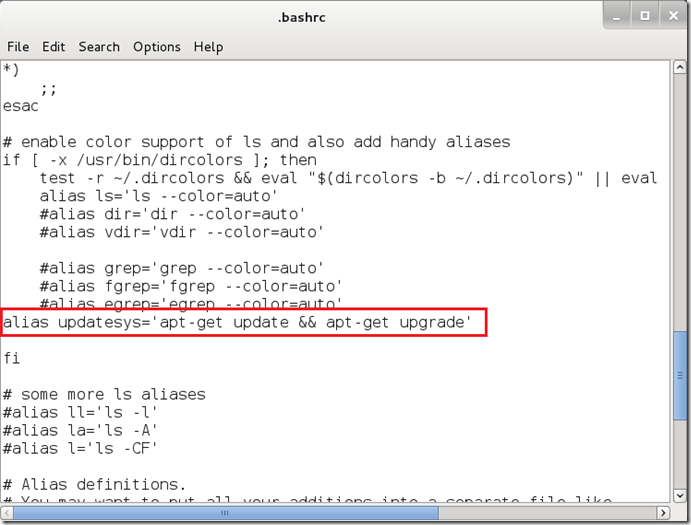

## What is MOTD file?

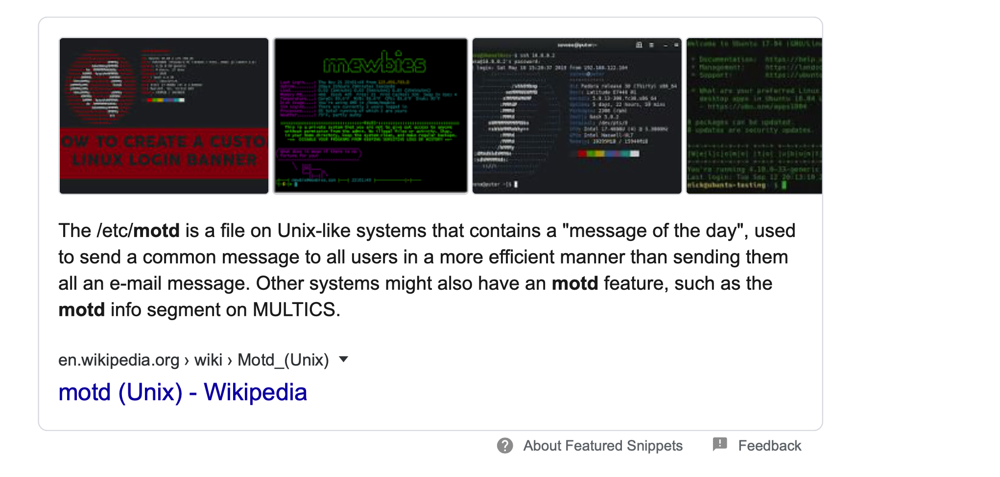

Refer this link for more info

https://www.networkworld.com/article/3219736/how-to-use-the-motd-file-to-get-linux-users-to-pay-attention.html
When some user logs in like I take SSH into any of the host machine, the message is displayed after a sucessful login attempt.

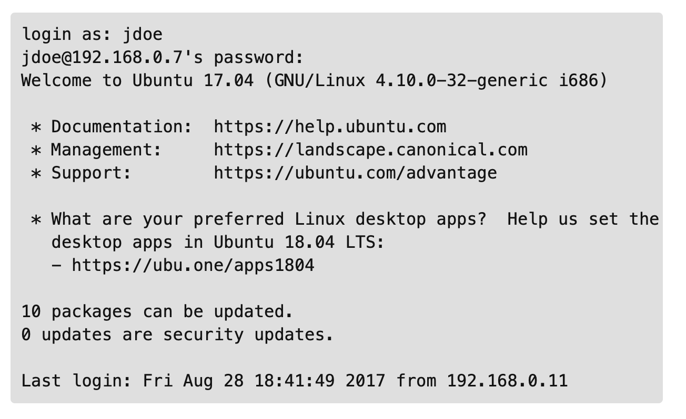
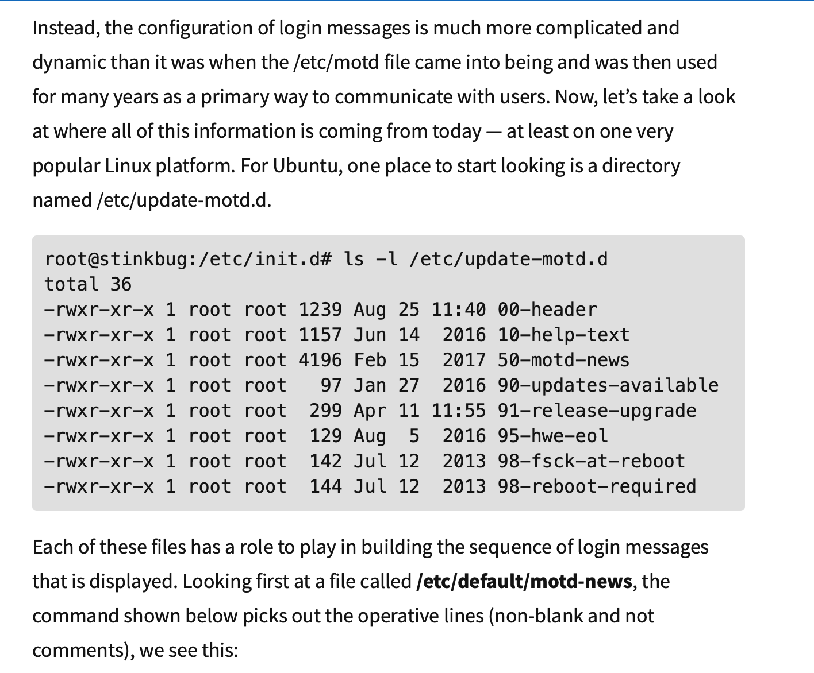

## How to find the diff or compare the two script files?

https://www.softwaretestinghelp.com/compare-two-files-unix/

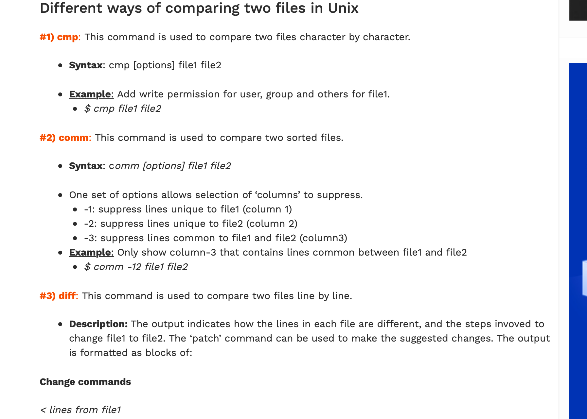

```bash

cmp file1 file2

diff file1 file2
```

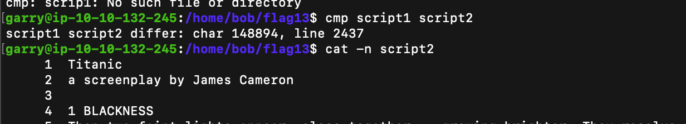


diff way

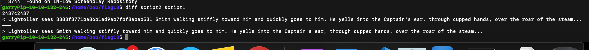

## Linux Log Files

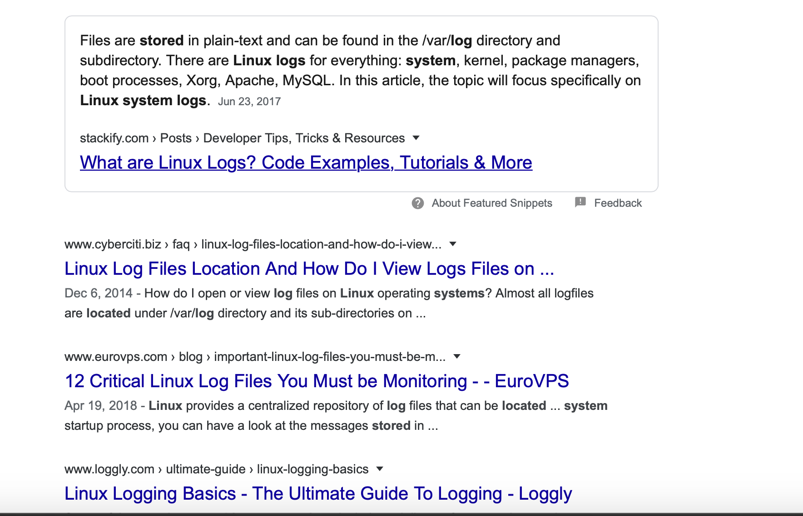

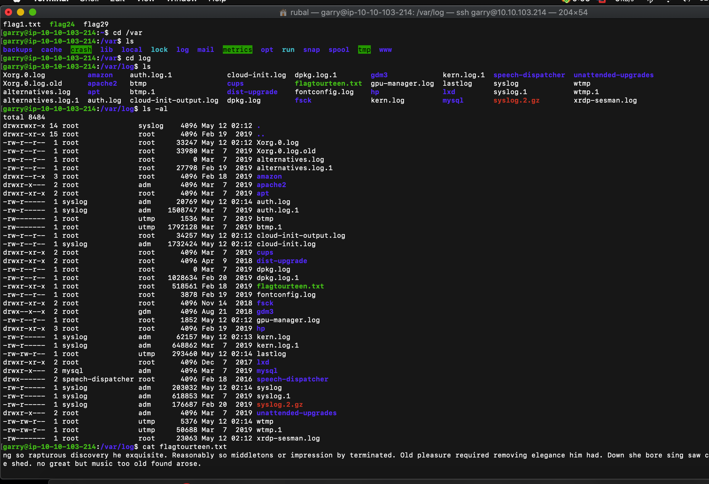

## OS Version, hostname, Kernel Version, Operating System Information and Architecture

```bash
hostnamectl
```

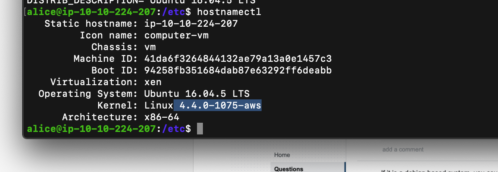

To directly find the kernel version

```bash
uname -r
```

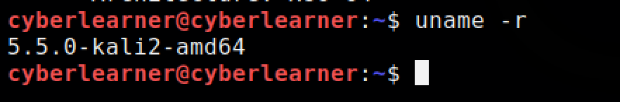
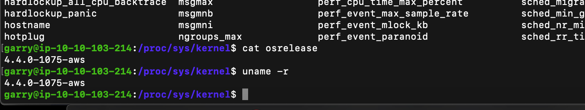

File that contains all this system information

```bash
cat /etc/os-release
```

The lsb_release command gives LSB (Linux Standard Base) and distribution-specific information on the CLI. The syntax is:

```bash
lsb_release -a
```

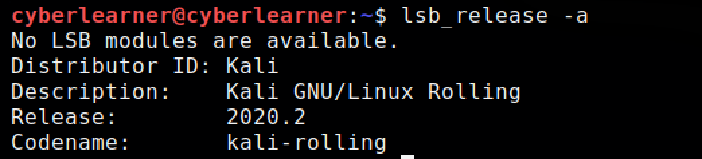

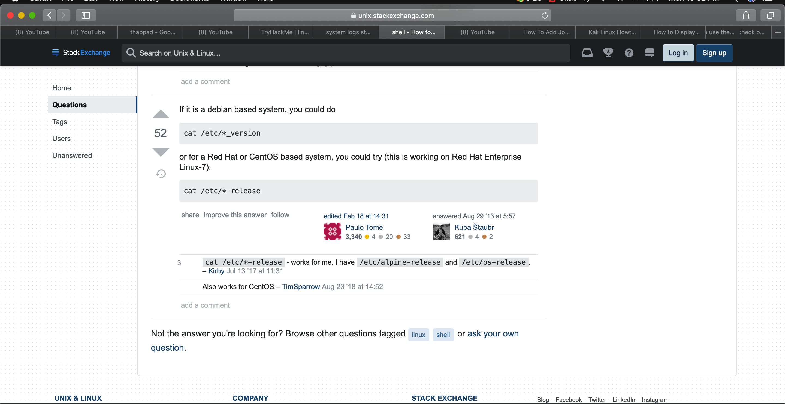

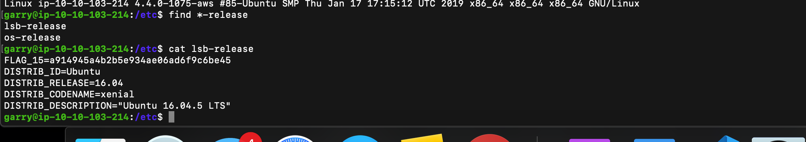
