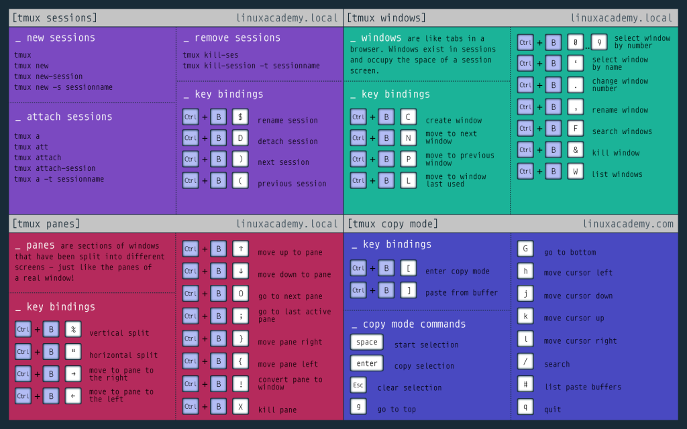

## Learning TMUX

A great blog post to learn about tmux.

https://www.hamvocke.com/blog/a-quick-and-easy-guide-to-tmux/

I have the saved the custom .tmux.conf file which has some good handy features that I need in termnial.

Refer this link to learn about customising tmux

https://www.hamvocke.com/blog/a-guide-to-customizing-your-tmux-conf/

http://www.deanbodenham.com/learn/tmux-conf-file.html
